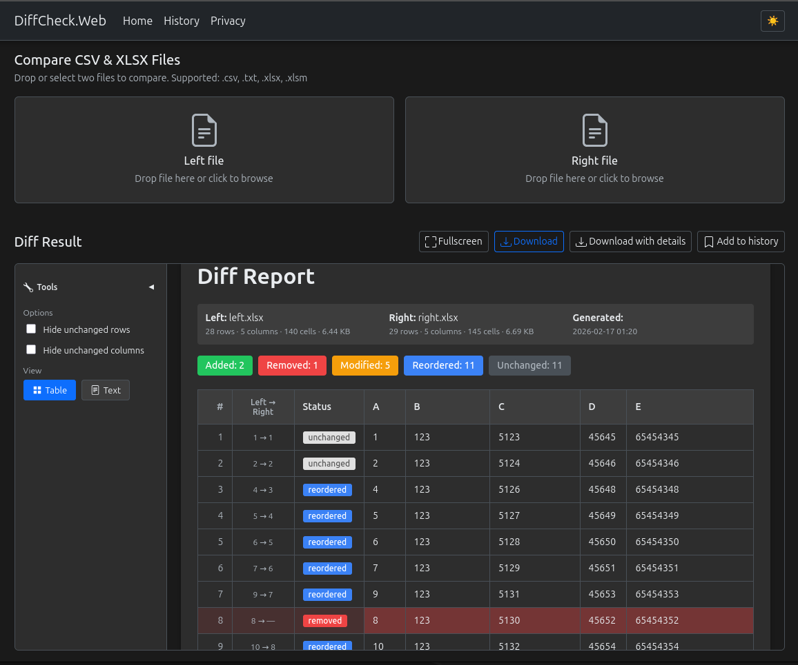

# DiffCheck

A .NET 10 tool for comparing CSV and XLSX files. Produces HTML reports with color-coded differences.



## Features

- **CSV support** – Compare comma-separated and tab-delimited files
- **XLSX support** – Compare Excel workbooks (first sheet by default)
- **HTML output** – Color-coded table: green (added), red (removed), amber (modified), blue (reordered)
- **Character-level diff** – Git-style literal diff: changes highlighted per character (round red/green boxes) in both table and text views, not just per line
- **Content-based matching** – Detects reordered rows via column similarity (50% threshold)
- **File stats** – Report header shows file size, row count, column count, and total cells per file
- **Report tools** – Table vs text view, hide unchanged rows/columns, light/dark theme
- **Diff history** – Save runs to browser (IndexedDB), tag runs, search by file names or tags, open fullscreen or download report with details
- **Dark theme** – HTML reports and web UI (navbar, History) support light and dark themes
- **CLI, Web, and library** – Use via command line, web UI, or embed in your .NET projects

## Quick start

### CLI

```bash
# Run from repo
dotnet run --project DiffCheck.Cli -- left.csv right.csv

# Or with custom output
dotnet run --project DiffCheck.Cli -- left.xlsx right.xlsx -o report.html
```

### Web app

```bash
dotnet run --project DiffCheck.Web
```

Open http://localhost:5000, upload two files, and view the diff report. Supports drag-and-drop and dark theme. You can add the current report to **History** (client-side only), tag runs, and search by file names or tags. The Privacy page describes file handling and browser storage (localStorage for theme, IndexedDB for history).

## Project structure

| Project                | Description                                          |
| ---------------------- | ---------------------------------------------------- |
| `DiffCheck.Core`       | Library: readers, diff engine, HTML report generator |
| `DiffCheck.Cli`        | Command-line tool                                    |
| `DiffCheck.Web`        | Razor Pages web app with file upload                 |
| `DiffCheck.Core.Tests` | Unit tests (MSTest)                                  |

## Library usage

### Basic comparison

```csharp
using DiffCheck;

var service = new DiffCheckService();

// Compare and save HTML report
await service.CompareAndSaveHtmlAsync(
	leftFilePath: "file1.csv",
	rightFilePath: "file2.csv",
	outputPath: "diff-report.html"
);
```

### Step-by-step (for custom workflows)

```csharp
// 1. Compare files
var result = await service.CompareAsync("old.xlsx", "new.xlsx");

// 2. Check summary
Console.WriteLine($"Added: {result.Summary.AddedRows}, Removed: {result.Summary.RemovedRows}");

// 3. Generate HTML (with optional file sizes and theme)
var html = service.GenerateHtml(
	result,
	"old.xlsx",
	"new.xlsx",
	leftFileSize: 1024,
	rightFileSize: 2048,
	theme: "dark"
);

// Or write to file
await service.WriteHtmlToFileAsync(result, "report.html", "old.xlsx", "new.xlsx");
```

### Custom HTML colors

```csharp
var options = new HtmlReportOptions
{
	AddedColor = "#22c55e", // green
	RemovedColor = "#ef4444", // red
	ModifiedColor = "#f59e0b", // amber
	ReorderedColor = "#3b82f6", // blue
};
var service = new DiffCheckService(options);
```

### Custom readers (e.g., specific XLSX sheet)

```csharp
var xlsxReader = new XlsxReader(sheetIndex: 1); // second sheet
var service = new DiffCheckService(xlsxReader, xlsxReader);
var result = await service.CompareAsync("a.xlsx", "b.xlsx");
```

## Supported formats

| Extension | Format        |
| --------- | ------------- |
| `.csv`    | CSV           |
| `.txt`    | CSV (treated) |
| `.xlsx`   | Excel 2007+   |
| `.xlsm`   | Excel macro   |

## Development

### Run tests

```bash
dotnet test DiffCheck.Core.Tests
```

### Formatting

This project uses [CSharpier](https://csharpier.com/) for code formatting.

```bash
dotnet csharpier format .
```

Format-on-save is configured in `.vscode/settings.json` when using the CSharpier extension. CSharpier runs automatically on pre-commit via [Husky.NET](https://alirezanet.github.io/Husky.Net/). Git hooks are installed on `dotnet restore`.

### Requirements

- .NET 10.0 (or change `TargetFramework` to `net8.0` if needed)

### Dependencies

- [ClosedXML](https://github.com/ClosedXML/ClosedXML) – XLSX reading
- [CsvHelper](https://github.com/JoshClose/CsvHelper) – CSV parsing
